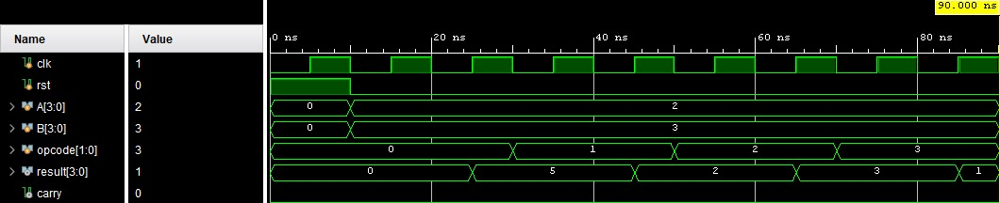
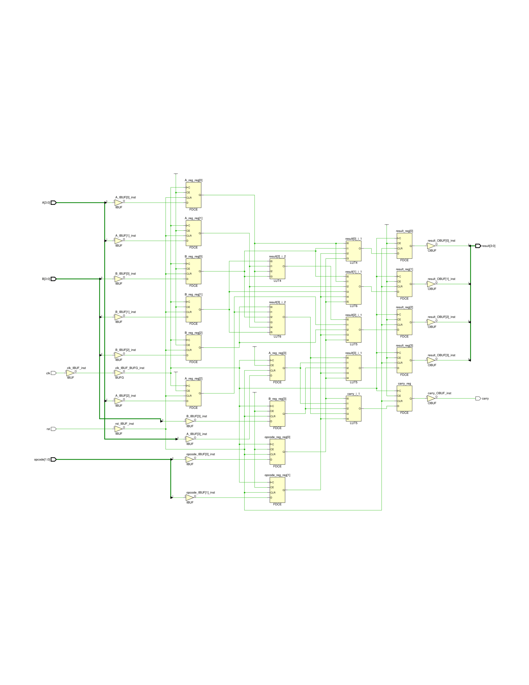
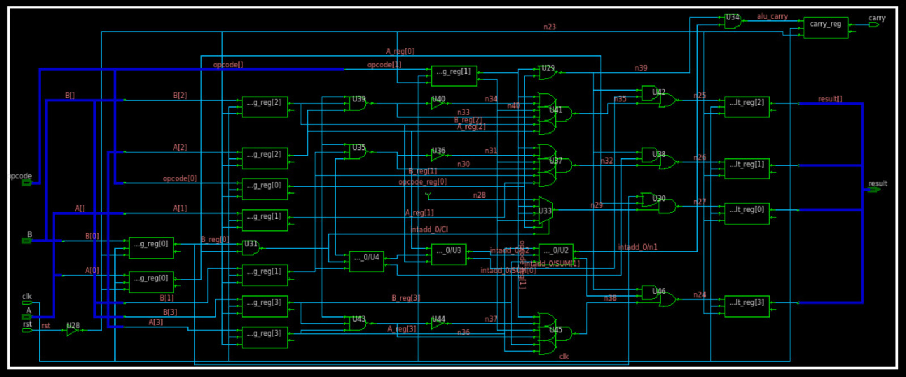
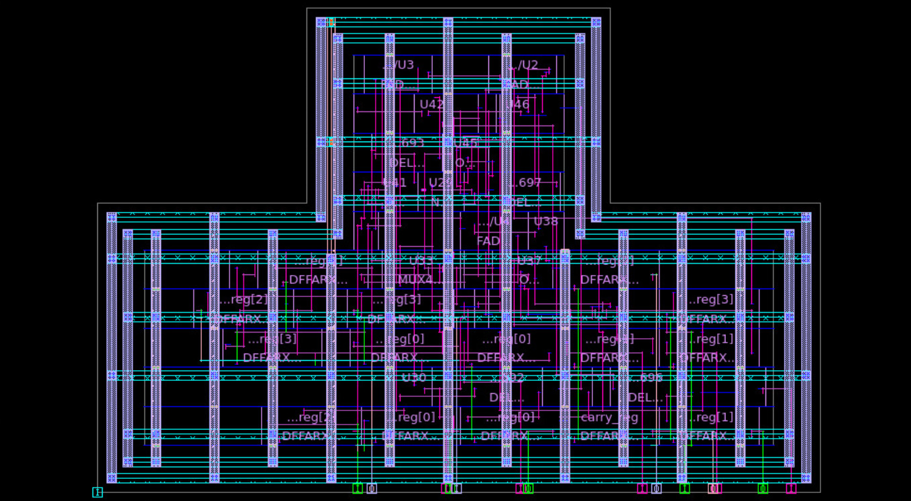

# RTL to GDS-II: 4-bit Sequential ALU

## 📌 Project Overview
This project implements a 4-bit Sequential Arithmetic Logic Unit (ALU) and demonstrates the complete RTL to GDS-II flow using Synopsys EDA tools.

The design is first verified using Vivado for functional correctness and then taken through synthesis, physical design, and static timing analysis in a Linux-based ASIC design environment.

---

## ⚙️ Design Features
- 4-bit ALU
- Supported Operations:
  - ADD
  - AND
  - OR
  - XOR
- Sequential pipelined architecture:

  Input Register → ALU → Output Register

- Pipeline latency: 2 clock cycles

---

## 🔍 RTL Verification (Vivado)
- Verilog RTL and testbench developed
- Functional simulation performed using Vivado
- Verified all ALU operations
- Observed correct pipeline behavior (2-cycle delay)
- Generated RTL schematic for structural validation

## 📷 RTL Simulation Results

### Waveform

### RTL Schematic

---

## 🛠️ Tools Used
- Xilinx Vivado – RTL Simulation & Schematic
- Synopsys Design Compiler (DC) – Logic Synthesis
- Synopsys IC Compiler II (ICC2) – Physical Design
- Synopsys PrimeTime (PT) – Static Timing Analysis

---

## 🔄 Design Flow

### 1. RTL Design & Verification
- RTL code written in Verilog
- Testbench created for verification
- Simulation and schematic validation performed in Vivado

---

### 2. Logic Synthesis (Design Compiler)
- RTL synthesized using SAED32nm standard cell library
- Technology mapping performed to generate gate-level netlist

Commands:

dc_shell
source dc_script.tcl

### 📷 Synthesized Design

Generated:
- Gate-level netlist
- Timing report
- Area report

---

### 3. Physical Design (ICC2)

Executed full place-and-route flow:

icc2_shell

source 01_setup.tcl
source 02_netlist_read.tcl
source 03_floorplan.tcl
source 04_power_planning.tcl
source 05_placement.tcl
source 06_clock.tcl
source 07_route.tcl
source 08_signoff_outputs.tcl

#### Steps:
- Setup → Technology and libraries loaded  
- Netlist Read → Design imported  
- Floorplan → Core area and IO placement  
- Power Planning → VDD/VSS mesh and rings  
- Placement → Standard cell placement  
- Clock Tree Synthesis → Clock distribution  
- Routing → Metal interconnect  
- Signoff → Final GDSII generation  

---

## 📷 Physical Design Output

### Final Layout (GDS View)

---

### 4. Static Timing Analysis (PrimeTime)

Commands:

pt_shell
source run_pt_p1.tcl
source run_pt_p2.tcl

Verified:
- Setup timing → PASS  
- Hold timing → PASS  

---

## 📊 Results

| Parameter | Value |
|----------|------|
| Clock Period | 10 ns |
| Critical Path Delay | ~3.64 ns |
| Worst Setup Slack | +5.62 ns |
| Hold Violations | None |

---

## 🧠 Key Insights

- Critical path dominated by ripple carry adder delay  
- Logical operations implemented using standard cell combinations (AO, OA, AND) rather than dedicated XOR cells  
- Routing increases delay due to parasitic effects  
- Design meets timing at 100 MHz  
- Design fails at ~3 ns clock → requires optimization  
- Pipelining improves timing closure  

---

## 📁 Repository Structure

rtl/ → Verilog RTL & Testbench
constraints/ → SDC file
synthesis/ → Design Compiler scripts
physical_design/ → ICC2 scripts (01–08)
sta/ → PrimeTime scripts
reports/ → Timing, area, power reports
results/ → Netlist, GDS, layout images

---

## 🚀 Future Improvements
- Upgrade to 8-bit ALU
- Replace ripple carry adder with Carry Lookahead Adder (CLA)
- Optimize for higher frequency
- Improve power efficiency

---

## 💡 Conclusion
This project demonstrates a complete ASIC design flow from RTL to GDS-II, including verification, synthesis, physical design, and timing analysis. It highlights the importance of timing closure, pipelining, and architectural decisions in digital design.
